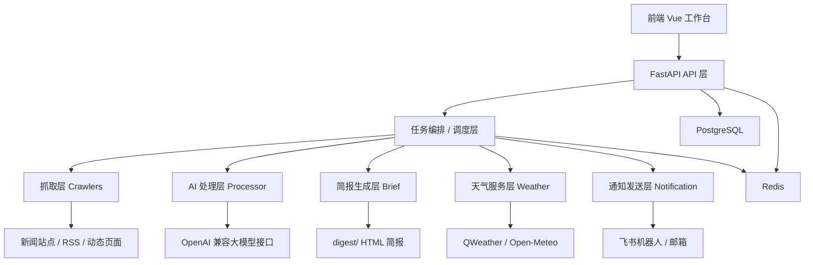

# IntelliBrief

IntelliBrief 是一个面向“新闻抓取、AI 处理、简报生成、天气查询、消息推送”的一体化系统。项目同时提供后端 API、前端工作台、定时调度、消息推送和运行时数据管理能力，适合做企业内部情报简报、行业资讯播报、天气与台风辅助信息推送等场景。

项目当前已经从“单机脚本”演进为“可部署服务”形态，核心特征包括：

- 支持静态网页、动态网页、RSS 等多源抓取。
- 支持 PostgreSQL、Redis、Playwright、OpenAI 兼容大模型接口。
- 支持多主题、多关键词、多时间段定时生成简报。
- 支持飞书机器人、邮箱发送，以及天气/台风独立展示。
- 支持多人使用时的用户隔离配置。

## 目录

- [项目概览](#项目概览)
- [核心能力](#核心能力)
- [系统架构](#系统架构)
- [技术栈](#技术栈)
- [功能说明](#功能说明)
- [核心业务流程](#核心业务流程)
- [项目目录与文件说明](#项目目录与文件说明)
- [环境变量说明](#环境变量说明)
- [本地运行方法](#本地运行方法)
- [服务器部署与更新](#服务器部署与更新)
- [测试与排查](#测试与排查)
- [适用场景](#适用场景)

## 项目概览

### 解决的问题

传统新闻简报流程通常存在这些问题：

- 信息来源分散，人工收集成本高。
- 不同新闻源页面结构差异大，维护困难。
- 同一天多主题、多关键词的简报生成和定时发送容易串数据。
- 天气、预警、台风等辅助信息和简报信息经常分散在不同系统中。
- 前后端、调度、推送、缓存、数据库缺少统一工程化管理。

IntelliBrief 的目标是把这些能力统一到一个工程中，形成从“抓取数据”到“发送结果”的完整链路。

### 当前支持的业务方向

- `国外新闻`
- `AI资讯`
- `天气情况`
- `台风监测`
- `飞书/邮箱通知`

## 核心能力

- 新闻抓取：
  支持静态站点、动态站点、RSS/聚合源；动态站点基于 Playwright，可自动处理渲染后的 DOM、网络响应抓取和脚本兜底提取。

- AI 处理：
  支持多阶段大模型处理，包括筛选、摘要、分类；模型提供方通过 `.env` 统一切换，不要求改业务代码。

- 简报生成：
  支持按主题、关键词、日期生成 HTML 简报；支持同一天同主题同关键词增量合并，避免旧内容被覆盖。

- 调度能力：
  使用 APScheduler 管理“定时生成”和“定时发送”；支持一个主题配置多个时间段。

- 天气模块：
  支持地区天气、逐小时天气、预警信息、台风列表、台风路径、地图展示和最近查询缓存。

- 通知发送：
  支持飞书机器人卡片、邮箱 HTML 内容发送；同一条消息中可以合并多份简报。

- 并发与隔离：
  使用 `BriefRun + ArticleRun` 作为一次运行的隔离单元，降低多人并发操作时的数据串扰风险。

## 系统架构



### 架构分层说明

1. `前端层`
   使用 Vue 3 + Vite 提供工作台、天气页面、简报列表、发送设置页面。

2. `API 层`
   使用 FastAPI 暴露 REST 接口，负责参数校验、统一响应格式、用户隔离和模块协调。

3. `任务层`
   `scheduler/tasks.py` 负责全流程编排，`app/api/tasks.py` 负责接口入口和 APScheduler 配置同步。

4. `抓取层`
   `crawlers/` 负责对接不同源，支持静态解析、动态渲染和脚本兜底。

5. `处理层`
   `processor/` 负责正文清洗、去重、AI 调用、提示词管理和结构化结果生成。

6. `输出层`
   `brief/` 负责生成 HTML 简报；`app/modules/notification/` 负责飞书和邮箱消息发送。

7. `数据层`
   PostgreSQL 保存业务数据，Redis 保存缓存、游标和兼容 Celery 的 Broker/Backend。

## 技术栈

### 后端

- `FastAPI`
- `SQLAlchemy 2.x`
- `Pydantic 2.x`
- `APScheduler`
- `Celery`
- `Redis`
- `PostgreSQL`
- `Playwright`
- `BeautifulSoup4`
- `lxml`
- `requests`
- `OpenAI Python SDK`
- `Jinja2`

### 前端

- `Vue 3`
- `Vite`
- `Axios`

### 运维与部署

- `Nginx`
- `systemd`
- `Docker / Docker Compose`

## 功能说明

### 1. 新闻抓取与增量采集

支持按数据源抓取当日新闻，如果当天没有文章，则回退到“最近有文章的日期”。系统会结合 Redis 或 PostgreSQL 中保存的抓取游标，只抓取新增内容，减少重复处理。

实现逻辑：

1. 读取 `Source` 配置。
2. 根据来源类型选择静态爬虫或动态爬虫。
3. 提取列表页文章 URL、标题、日期等元数据。
4. 抓取详情页正文、日期、图片。
5. 根据日期、URL、去重策略过滤结果。
6. 保存到 `Article` 表，并关联到当前 `BriefRun`。

### 2. 动态网页抓取

动态抓取主要用于如环球网这类前端渲染站点。系统会优先尝试系统 `Chrome`，失败后自动回退到 Playwright 自带 `Chromium`，适配服务器缺少系统浏览器的场景。

实现逻辑：

1. 使用 Playwright 打开页面。
2. 等待页面核心节点或滚动加载。
3. 从 DOM、网络响应、脚本文本中多层兜底提取文章列表。
4. 进入详情页提取正文与图片。
5. 对无法稳定等待的站点，支持跳过前置等待并直接从 HTML 或 XPath 中抽取。

### 3. AI 筛选、摘要与分类

系统把 AI 处理拆分成多步，使得模型职责单一、失败面更小、可替换性更高。

实现逻辑：

1. 第一步：
   根据主题和关键词组合做相关性筛选。

2. 第二步：
   对保留文章生成一句话摘要、要点和标签。

3. 第三步：
   对文章做主题分类，统一简报中的分组展示。

### 4. 简报生成

系统会把一次运行中的文章结果整合成 HTML 简报，并保存到数据库和 `digest/` 目录。

实现逻辑：

1. 读取当前 `BriefRun` 的 `ArticleRun`。
2. 如果当天同主题同关键词已有旧简报，则合并旧文章和本次新文章。
3. 使用 Jinja2 模板渲染 HTML。
4. 写入 `Brief` 表。
5. 把 HTML 文件落盘到 `digest/`。

### 5. 多时间段定时生成

一个主题可配置多个生成时间点，每个时间点都可以保存当时的主题和关键词快照。

实现逻辑：

1. 前端把多个定时项提交给 `/tasks/schedule`。
2. 后端规范化成 `items` 数组结构。
3. 使用 APScheduler 为每个时间点注册独立 Job。
4. FastAPI 启动时自动恢复这些 Job。

### 6. 定时发送与多日期范围发送

支持给飞书和邮箱配置独立发送时间，并支持发送：

- 今天简报
- 昨天简报
- 今天 + 昨天简报

实现逻辑：

1. 前端保存 `brief_date_scopes`。
2. 后端把 `today / yesterday` 解析为真实日期。
3. 查询多个日期范围内的简报。
4. 组装成一条飞书消息或一封邮件。

### 7. 天气与台风模块

天气模块和简报模块解耦，不把天气直接写入简报 HTML，而是作为独立业务模块存在。

实现逻辑：

1. 接收地区输入。
2. 优先查询 QWeather，失败时回退到 Open-Meteo。
3. 返回逐小时天气、预警、台风信息。
4. 前端展示天气详情、地图路径和点位信息。
5. 发送时将天气、台风与简报组合为统一消息。

### 8. 多用户配置隔离

项目没有接入完整账号系统，而是通过 `X-User-Key` 作为轻量级用户标识，实现发送设置和调度配置隔离。

实现逻辑：

1. 前端本地存储当前用户标识。
2. 请求时放入 `X-User-Key` 请求头。
3. 后端用该值做配置键隔离。
4. 定时发送 Job 也按用户维度区分。

## 核心业务流程

### 一键生成简报流程

1. 前端提交主题、关键词、用户标识。
2. 后端创建 `BriefRun`。
3. 调度层触发对应数据源爬取。
4. 原始文章写入 `Article`。
5. AI 处理结果写入 `ArticleRun`。
6. `brief/generator.py` 渲染并保存 `Brief`。
7. 前端刷新简报列表。

### 定时生成流程

1. 前端保存多个定时项。
2. API 写入数据库设置。
3. APScheduler 注册 Job。
4. FastAPI 重启后自动恢复。
5. 到点执行 `run_all_tasks_immediately()`。

### 定时发送流程

1. 前端保存飞书/邮箱发送时间和日期范围。
2. API 写入数据库设置。
3. APScheduler 注册发送 Job。
4. 到点查询当天或昨日简报。
5. 拼装飞书卡片或邮件正文并发送。

## 项目目录与文件说明

### 顶层目录

| 路径 | 作用 |
| --- | --- |
| `app/` | 后端 API、配置、数据库、模型和业务模块 |
| `brief/` | 简报 HTML 生成与兼容通知入口 |
| `crawlers/` | 新闻抓取实现，包含静态、动态、RSS 等 |
| `frontend/` | Vue 前端工程 |
| `processor/` | AI 处理、正文清洗、去重与提示词 |
| `scheduler/` | 全流程任务编排与 Celery 兼容支持 |
| `test/` | 测试脚本、迁移工具和人工检查清单 |
| `utils/` | 通用工具，如大模型路由 |
| `digest/` | 运行时生成的简报 HTML 文件 |
| `photo/` | 抓取过程中保存的文章图片 |

### 后端关键文件

| 文件 | 作用 |
| --- | --- |
| [app/main.py](app/main.py) | FastAPI 应用入口，注册路由、静态目录、异常处理和 APScheduler 恢复 |
| [app/config.py](app/config.py) | 环境变量读取、来源 XPath 配置、公共 URL 推导 |
| [app/database.py](app/database.py) | SQLAlchemy 引擎、Session、PostgreSQL 启动补丁 |
| [app/cache.py](app/cache.py) | Redis 连接与回退逻辑 |
| [app/api/tasks.py](app/api/tasks.py) | 生成、定时生成、定时发送相关 API |
| [app/api/briefs.py](app/api/briefs.py) | 简报查询、查看、软删除接口 |
| [app/api/weather.py](app/api/weather.py) | 天气、地区联想、最近查询接口 |
| [app/api/settings.py](app/api/settings.py) | 前端绑定设置、调度设置读写接口 |
| [app/models/article.py](app/models/article.py) | 原始文章数据模型 |
| [app/models/brief.py](app/models/brief.py) | 简报模型，保存 HTML、关键词、关联文章 |
| [app/models/brief_run.py](app/models/brief_run.py) | 一次简报运行和文章运行结果的隔离模型 |
| [app/models/source.py](app/models/source.py) | 新闻源配置模型 |

### 模块目录说明

| 路径 | 作用 |
| --- | --- |
| `app/modules/common/` | 公共设置存储、缓存存储等跨模块能力 |
| `app/modules/scheduler/` | APScheduler 运行时封装 |
| `app/modules/weather/` | 天气模块的服务封装与最近查询存储 |
| `app/modules/notification/` | 飞书卡片、邮件正文、发送绑定配置 |
| `app/modules/brief/` | 简报投递兼容层和飞书简报消息入口 |

### 抓取与处理文件

| 文件 | 作用 |
| --- | --- |
| `crawlers/base.py` | 爬虫基类和原始文章结构定义 |
| `crawlers/web_static.py` | 静态网页新闻抓取 |
| `crawlers/web_dynamic.py` | 动态网页新闻抓取，Playwright 入口 |
| `crawlers/rss_spider.py` | RSS 订阅源抓取 |
| `processor/cleaner.py` | 正文提取、图片提取和清洗 |
| `processor/dedup.py` | 增量抓取游标、缓存与去重逻辑 |
| `processor/ai_engine.py` | AI 异步处理入口 |
| `processor/prompts.py` | 各阶段大模型提示词 |
| `utils/llm_router.py` | 多模型、多 Key 路由和调用容错 |

### 简报与调度文件

| 文件 | 作用 |
| --- | --- |
| `brief/generator.py` | 合并文章、渲染并落盘 HTML 简报 |
| `brief/notifier.py` | 历史兼容通知导出入口 |
| `scheduler/tasks.py` | 全流程主编排：抓取、入库、AI、生成、发送 |
| `scheduler/celery_app.py` | Celery App 定义，Redis 作为 Broker/Backend |
| `scheduler/periodic.py` | 旧 Celery Beat 配置兼容文件 |

### 前端关键文件

| 文件 | 作用 |
| --- | --- |
| `frontend/src/main.js` | Vue 应用入口 |
| `frontend/src/App.vue` | 总控页面，整合工作台、简报列表、发送设置 |
| `frontend/src/state.js` | 全局状态与主题切换 |
| `frontend/src/styles.css` | 全局样式 |
| `frontend/src/api/*.js` | 前端 API 调用封装 |
| `frontend/src/modules/brief/components/BriefTable.vue` | 简报列表组件 |
| `frontend/src/modules/weather/components/WeatherPanel.vue` | 天气主面板组件 |
| `frontend/src/modules/weather/components/TyphoonMap.vue` | 台风路径地图组件 |
| `frontend/src/modules/common/components/*.vue` | 通用 UI 组件 |

### 测试与工具文件

| 文件 | 作用 |
| --- | --- |
| `test/runtime_data_bundle.py` | 运行时数据打包与导入导出工具 |
| `test/migrate_sqlite_to_postgres.py` | SQLite 向 PostgreSQL 迁移脚本 |
| `test/test_qweather_selfcheck.py` | 和风天气接口自检 |
| `test/test_weather_module.py` | 天气模块功能测试 |
| `test/test_notification_module.py` | 通知模块测试 |
| `test/manual_feature_checklist.md` | 人工功能检查清单 |
| `test/manual_weather_feature_checklist.md` | 天气模块人工检查清单 |

### 运行与部署文件

| 文件 | 作用 |
| --- | --- |
| `requirements.txt` | Python 依赖 |
| `Dockerfile` | Docker 镜像构建文件 |
| `docker-compose.yml` | Docker Compose 本地联调示例 |
| `.env.example` | 环境变量模板 |
| `.gitignore` | Git 忽略规则 |

## 环境变量说明

项目配置统一放在 `.env` 中，`.env.example` 提供示例。

主要配置分类：

- 数据库与缓存：
  `DATABASE_URL`、`REDIS_URL`、`REDIS_FALLBACK_URL`

- 大模型：
  `FIRST_LLM_*`、`SECOND_LLM_*`、`THIRD_LLM_*`

- 通知：
  `EMAIL_*`、`FEISHU_WEBHOOK`

- 天气：
  `WEATHER_PROVIDER`、`QWEATHER_*`、`OPEN_METEO_*`

- 前端与公共访问地址：
  `FRONTEND_ORIGINS`、`PUBLIC_BASE_URL`

设计原则：

1. 更换大模型只改 `.env`，不改业务代码。
2. 优先通过环境变量切换外部依赖。
3. 公网访问链接通过 `PUBLIC_BASE_URL` 统一生成，避免飞书和邮箱里出现 `localhost`。

## 本地运行方法

### 1. 准备环境

- Python 3.10+
- Node.js 18+
- PostgreSQL
- Redis

### 2. 安装后端依赖

```bash
python -m venv venv
source venv/bin/activate
pip install -r requirements.txt
playwright install chromium
```

Windows PowerShell:

```powershell
.\venv\Scripts\Activate.ps1
pip install -r requirements.txt
playwright install chromium
```

### 3. 配置环境变量

```bash
cp .env.example .env
```

根据实际情况修改：

- PostgreSQL 连接
- Redis 连接
- 大模型 API Key、模型名、Base URL
- QWeather Key
- `PUBLIC_BASE_URL`

### 4. 启动后端

```bash
uvicorn app.main:app --host 127.0.0.1 --port 8000
```

### 5. 启动前端开发环境

```bash
cd frontend
npm install
npm run dev
```

默认访问：

- 前端：`http://127.0.0.1:5173`
- 后端：`http://127.0.0.1:8000`
- API 文档：`http://127.0.0.1:8000/docs`

### 6. 启动 Celery Worker

```bash
celery -A scheduler.celery_app worker -l info -P gevent
```

说明：
项目的定时生成和定时发送现在主要由 APScheduler 执行；Celery 仍用于异步任务兼容路径和历史调度能力。

## 服务器部署与更新

### 典型生产结构

- 后端：
  `uvicorn + systemd`

- 前端：
  `Nginx` 指向 `frontend/dist`

- 数据：
  `PostgreSQL + Redis`

### 生产更新步骤

```bash
cd /srv/intellibrief
git fetch origin
git pull --ff-only origin master

source venv/bin/activate
pip install -r requirements.txt
playwright install chromium

cd frontend
npm install
npm run build

cd /srv/intellibrief
sudo systemctl restart intellibrief-web
sudo systemctl restart intellibrief-celery-worker
sudo systemctl restart intellibrief-celery-beat
sudo nginx -t
sudo systemctl reload nginx
```

### 前端为什么必须重新构建

因为服务器通常通过 Nginx 直接读取 `frontend/dist`。  
`git pull` 只会更新 `src` 源码，不会自动生成新的静态构建文件，所以每次前端改动都必须重新执行：

```bash
npm run build
```

## 测试与排查

### 推荐测试方式

1. 配置环境变量。
2. 运行后端。
3. 运行前端。
4. 通过工作台生成简报。
5. 检查简报列表、天气页面、发送设置页面。
6. 查看 `digest/` 和 `photo/` 是否生成内容。

### 常见排查方向

- 国外新闻爬取失败：
  检查 Playwright 浏览器是否安装，服务器是否能启动 `Chrome` 或 `Chromium`。

- 飞书/邮箱链接错误：
  检查 `PUBLIC_BASE_URL` 是否配置为公网 IP 或域名。

- 前端页面还是旧版本：
  检查 `frontend/dist` 是否重新构建，Nginx 是否仍指向旧目录。

- 天气查询失败：
  检查 QWeather Key、Host 和网络解析能力。

- Redis 不可用：
  项目会尝试回退到 PostgreSQL 部分缓存能力，但 Celery Broker/Backend 仍依赖 Redis。

### 有用的日志命令

```bash
sudo journalctl -u intellibrief-web -n 100 --no-pager
sudo journalctl -u intellibrief-celery-worker -n 100 --no-pager
sudo journalctl -u intellibrief-celery-beat -n 100 --no-pager
```

## 适用场景

- 企业内部每日情报播报
- 海外资讯监控与简报输出
- AI 行业资讯跟踪
- 天气与台风辅助信息播报
- 飞书或邮箱自动化日报

## 项目特点总结

- 把新闻抓取、AI 处理、天气、台风、发送能力集成到一个系统中。
- 通过 `BriefRun` 和 `ArticleRun` 提升多用户、多任务并发下的数据隔离能力。
- 支持服务器环境下的浏览器回退策略，降低动态抓取失败率。
- 大模型配置、天气源配置和通知配置统一收敛到 `.env`，易于部署和替换。
- 前后端、调度、通知、缓存、数据库分层明确，适合继续扩展新主题、新站点和新模块。
